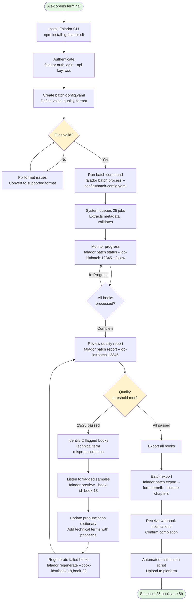

# Falador UX/UI Specification

_Generated on 2025-10-16 by Eduardo Menoncello_

## Executive Summary

### Project Context

**Falador** is an enterprise-scale AI-directed TTS platform designed specifically for Brazilian Portuguese audiobook production. The platform addresses a critical market gap where current TTS solutions deliver only 3.8/5 quality while professional audiobook production requires 4.5/5 standards.

**Target Market:**
- Brazilian audiobook market: $340M opportunity, 28% CAGR
- Primary segments: Technical publishers (20-500 books/month), Independent authors (voice cloning), Publishing houses (workflow integration)

**Core Value Propositions:**
- **Quality Excellence**: 4.5/5 Brazilian Portuguese narration quality (vs. 3.8/5 market average)
- **Production Efficiency**: 48-hour production timeline (vs. 4-6 weeks traditional)
- **Cost Reduction**: 80% savings ($75-200 vs. $1,600-6,000 per book)
- **Developer-First Experience**: CLI tools, RESTful APIs, batch processing automation
- **Voice Innovation**: Industry-leading voice cloning from 30-second samples

**Platform Architecture:**
- **CLI Interface**: Primary tool for technical users, batch processing, automation
- **Web Dashboard**: Project management, voice cloning, quality review, team collaboration
- **RESTful API**: Third-party integrations, webhook notifications, SDK support

**UX Design Scope:**
This specification covers the complete user experience across three primary interfaces (CLI, Web, API) with focus on progressive disclosure, quality transparency, and workflow efficiency for users ranging from technical developers to creative authors to enterprise publishing teams.

---

## 1. UX Goals and Principles

### 1.1 Target User Personas

#### Persona 1: Alex Chen - Technical Publisher (Developer Segment)

**Demographics:**
- Role: Technical Publisher / DevOps Lead
- Company: DevBooks Publishing (20-500 books/month)
- Technical Level: Expert (CLI-first, scripting, automation)

**Goals:**
- Automate batch processing of programming books into audiobooks
- Integrate audiobook production into CI/CD pipeline
- Achieve 95%+ first-pass quality with minimal manual intervention
- Monitor production progress programmatically

**Pain Points:**
- Manual audiobook production doesn't scale for large catalogs
- Traditional TTS tools lack specialized technical terminology support
- Quality inconsistency requires expensive human QA
- Lack of automation capabilities for publishing workflows

**User Journey Focus:** Journey 1 - Batch Audiobook Production (CLI-heavy)

**Key Requirements:**
- Comprehensive CLI with batch processing
- Scriptable configuration (YAML/JSON)
- Real-time status monitoring and logging
- Webhook notifications for automation
- Terminal-based efficiency (no GUI required for core workflows)

---

#### Persona 2: Carlos Silva - Independent Author (Creative Segment)

**Demographics:**
- Role: Fiction Author (Fantasy trilogy series)
- Context: First-time audiobook creator, budget-conscious
- Technical Level: Intermediate (comfortable with web UIs, occasional CLI)

**Goals:**
- Create audiobooks using own voice for authentic reader connection
- Maintain voice consistency across book series
- Control pronunciation of character names and world-building terms
- Achieve professional quality on indie budget

**Pain Points:**
- Professional narration costs $1,600-6,000 per book (prohibitive)
- Loss of creative control with third-party narrators
- Long production timelines (4-6 weeks) delay launches
- Pronunciation inconsistencies break reader immersion

**User Journey Focus:** Journey 2 - Personal Voice Cloning for Fiction Series (Web UI-focused)

**Key Requirements:**
- Intuitive voice cloning wizard with guided workflow
- Visual pronunciation editor with phonetic guidance
- Preview capabilities before final generation
- Chapter-by-chapter review and regeneration
- Clear quality scoring and improvement suggestions

---

#### Persona 3: Maria Santos - Publishing House Director (Enterprise Segment)

**Demographics:**
- Role: Digital Content Director
- Company: Editora Brasileira (100-book backlist, 15 new titles/month)
- Technical Level: Business user (manages technical teams, uses enterprise tools)

**Goals:**
- Convert entire backlist to audiobooks efficiently
- Establish team workflows with approval gates
- Integrate with existing publishing CMS and distribution platforms
- Maintain brand consistency across catalog

**Pain Points:**
- Catalog conversion at traditional costs is financially unfeasible
- Team coordination requires approval workflows and role management
- Quality control at scale demands systematic QA processes
- Distribution to multiple platforms requires metadata management

**User Journey Focus:** Journey 3 - Catalog Conversion and Workflow Integration (Enterprise features)

**Key Requirements:**
- Team collaboration with role-based access (Content Manager, QA Editor, Audio Director)
- Publisher brand voice creation and management
- Approval workflow gates
- CMS integration via API
- Bulk operations and batch status monitoring

---

### 1.2 Usability Goals

#### Primary Usability Objectives

**1. Ease of Learning**
- **For Technical Users (Alex):** CLI installation and first audiobook generation in <10 minutes
- **For Creative Users (Carlos):** Voice cloning wizard completion without documentation in <15 minutes
- **For Enterprise Users (Maria):** Team onboarding and first batch job in <1 hour with guided setup

**Target Metrics:**
- Time to first successful audiobook: <30 minutes (any user type)
- Support ticket rate: <5% of new users require assistance
- Tutorial completion rate: >80% for voice cloning wizard

**2. Efficiency for Power Users**
- **CLI Power Users:** Sub-second command execution, keyboard-driven workflows
- **Batch Processing:** Single command handles 100+ books with progress monitoring
- **Keyboard Shortcuts:** Web UI supports shortcuts for frequent actions (preview, approve, regenerate)

**Target Metrics:**
- CLI command response time: <100ms (95th percentile)
- Batch job setup time: <5 minutes for 100 books
- Web UI task completion 40% faster with keyboard shortcuts vs. mouse-only

**3. Error Prevention and Recovery**
- **Smart Defaults:** Pre-configured genre profiles, voice recommendations based on content type
- **Validation:** Real-time format checking, audio sample quality validation before processing
- **Graceful Degradation:** Partial batch failures don't block entire job; failed books flagged for retry

**Target Metrics:**
- User-caused errors: <2% of total operations
- Successful error recovery without support: >85%
- Clear error messages with actionable next steps: 100%

**4. Accessibility**
- **WCAG 2.1 AA Compliance:** All web interfaces keyboard navigable, screen reader compatible
- **Color Blindness Support:** Status indicators use icons + color, no color-only information
- **Internationalization:** Brazilian Portuguese as primary language, English support

**Target Metrics:**
- WCAG 2.1 AA automated testing: 100% pass rate
- Screen reader compatibility: Full workflow completion possible
- Keyboard-only navigation: All core features accessible

---

### 1.3 Design Principles

#### Core Design Principles for Falador

**1. Developer-First Efficiency**

*"Power users deserve powerful tools."*

- **CLI as First-Class Interface:** Terminal commands are not an afterthought—they receive equal design attention to GUI
- **Automation-Native:** Every feature designed for scriptability and integration (APIs, webhooks, config files)
- **Minimal Friction:** Sensible defaults allow immediate productivity; advanced customization available when needed
- **Transparent Operations:** Users see exactly what's happening (logs, progress, quality scores) without mystery boxes

**Application:**
- CLI commands follow Unix philosophy (composable, single-purpose, pipeable)
- Web UI provides "Show CLI Command" for every action (educational + automation path)
- JSON output modes for all operations enable scripting

---

**2. Progressive Disclosure**

*"Simple tasks should be simple; complex tasks should be possible."*

- **Layered Complexity:** Basic workflows (upload → generate → download) require 3 clicks; advanced features revealed contextually
- **Just-In-Time Guidance:** Help appears when users need it (tooltips on hover, contextual tutorials on first use)
- **Expert Mode Toggle:** Power users can hide guidance and collapse advanced panels

**Application:**
- Voice cloning starts with "Quick Start" (30-second sample + generate), advanced customization available in secondary panel
- Batch processing wizard guides beginners; `--config` file path for experts
- Pronunciation editor shows common corrections first, full phonetic controls available

---

**3. Quality Transparency**

*"Users trust what they can measure and understand."*

- **Visible Metrics:** Quality scores (4.5/5 target), processing times, cost estimates shown proactively
- **Preview Everything:** Sample audio, voice clones, chapter segments—never commit without hearing
- **Confidence Indicators:** System communicates certainty (e.g., "89% pronunciation confidence—review recommended")

**Application:**
- Real-time quality scoring during generation with per-chapter breakdown
- Waveform visualizations for audio review (not just playback)
- Comparative previews (before/after pronunciation corrections)

---

**4. Trust Through Control**

*"Creative users need agency over their art."*

- **Iterative Refinement:** Easy to regenerate chapters, adjust pronunciations, refine voice models—no penalties for experimentation
- **Undo/Versioning:** Project versioning allows rollback to previous generations
- **Ownership Clarity:** Users own voice clones and generated audio; platform rights explicitly stated

**Application:**
- "Regenerate Chapter" button always available, cost-transparent
- Pronunciation dictionary persists across projects (build institutional knowledge)
- Voice clones exportable for backup (user data portability)

---

**5. Platform Complementarity**

*"Different interfaces serve different workflows."*

- **CLI for Automation:** Batch operations, CI/CD integration, scripted workflows
- **Web for Collaboration:** Team workspaces, visual review, approval gates
- **API for Integration:** Third-party tools, custom workflows, enterprise systems

**Application:**
- Same project accessible via CLI and Web (sync'd state)
- API-first architecture ensures parity across interfaces
- CLI users can monitor jobs in Web UI; Web users can copy CLI commands

---

## 2. Information Architecture

### 2.1 Site Map

```
Falador Platform
│
├── 🏠 Dashboard (/)
│   ├── Project Overview Cards
│   ├── Quick Actions Panel
│   ├── Recent Activity Feed
│   └── Usage Analytics Widget
│
├── 📚 Projects (/projects)
│   ├── All Projects List View
│   ├── Project Detail (/projects/:id)
│   │   ├── Overview Tab
│   │   ├── Chapter Structure
│   │   ├── Audio Preview & Quality Review
│   │   ├── Settings & Configuration
│   │   └── Export & Distribution
│   ├── New Project Wizard (/projects/new)
│   │   ├── Step 1: Upload & Format Detection
│   │   ├── Step 2: Voice Selection
│   │   ├── Step 3: Configuration
│   │   └── Step 4: Review & Generate
│   └── Batch Processing (/projects/batch)
│       ├── Batch Job Configuration
│       ├── Batch Status Monitor
│       └── Bulk Actions Panel
│
├── 🎤 Voice Library (/voices)
│   ├── Voice Gallery (All Voices)
│   │   ├── My Cloned Voices
│   │   ├── Pre-built Voices
│   │   └── Publisher Brand Voices (Enterprise)
│   ├── Voice Detail (/voices/:id)
│   │   ├── Preview & Samples
│   │   ├── Customization Controls
│   │   └── Usage History
│   └── Clone Voice Wizard (/voices/new)
│       ├── Step 1: Sample Recording/Upload
│       ├── Step 2: Voice Processing
│       ├── Step 3: Preview & Refinement
│       └── Step 4: Save & Name
│
├── 🔧 Quality Tools (/tools)
│   ├── Pronunciation Dictionary (/tools/pronunciation)
│   │   ├── Global Dictionary (All Projects)
│   │   ├── Project-Specific Entries
│   │   └── Phonetic Editor
│   ├── Audio Review Interface (/tools/review)
│   │   ├── Waveform Visualization
│   │   ├── Side-by-side Comparison
│   │   └── Annotation & Feedback
│   └── Quality Reports (/tools/reports)
│       ├── Project Quality Scores
│       ├── Voice Performance Analytics
│       └── Error Logs & Diagnostics
│
├── 👥 Team (Enterprise) (/team)
│   ├── Team Members (/team/members)
│   │   ├── User Management
│   │   ├── Role Assignment
│   │   └── Permissions Matrix
│   ├── Workflows (/team/workflows)
│   │   ├── Approval Gates Configuration
│   │   ├── Task Assignment Rules
│   │   └── Notification Settings
│   └── Activity Log (/team/activity)
│       ├── Audit Trail
│       └── Team Analytics
│
├── 🔌 Integrations (/integrations)
│   ├── API Keys & Authentication
│   ├── Webhooks Configuration
│   ├── Publishing Platform Connections
│   │   ├── ACX/Audible
│   │   ├── Spotify Audiobooks
│   │   └── Custom Integrations
│   └── CMS Integration (Enterprise)
│
├── 📊 Analytics (/analytics)
│   ├── Usage Dashboard
│   ├── Cost Tracking
│   ├── Quality Metrics
│   └── Production Timeline Reports
│
├── ⚙️ Settings (/settings)
│   ├── Account Settings
│   │   ├── Profile & Billing
│   │   ├── Subscription Plan
│   │   └── Payment Methods
│   ├── Preferences
│   │   ├── Default Voice & Accent
│   │   ├── Genre Profiles
│   │   ├── Notification Preferences
│   │   └── Language & Localization
│   └── Advanced Settings
│       ├── API Configuration
│       ├── CLI Token Management
│       └── Export Defaults
│
├── 📖 Documentation (/docs)
│   ├── Getting Started Guide
│   ├── CLI Reference
│   ├── API Documentation
│   ├── Video Tutorials
│   └── FAQ & Troubleshooting
│
└── 🆘 Support (/support)
    ├── Help Center
    ├── Contact Support
    ├── Submit Ticket
    └── Service Status
```

**Information Hierarchy Notes:**

- **Depth Limit:** Maximum 3 levels deep for primary workflows (Dashboard → Projects → Project Detail)
- **Cross-Linking:** Voice Library accessible from Project creation wizard; Pronunciation Dictionary accessible from Audio Review
- **Role-Based Visibility:** Team section only visible to Enterprise users; certain settings restricted by user role
- **Context-Aware Navigation:** Active project shows quick-access controls in persistent header

---

### 2.2 Navigation Structure

#### Primary Navigation (Global Header)

**Desktop Layout (Top Navigation Bar):**

```
┌──────────────────────────────────────────────────────────────────────┐
│ [Falador Logo]  Dashboard  Projects  Voices  Tools  [Search]  [User] │
└──────────────────────────────────────────────────────────────────────┘
```

**Navigation Items:**

1. **Dashboard** - Home overview, quick actions
2. **Projects** - All projects, batch processing
   - Dropdown: All Projects | New Project | Batch Processing
3. **Voices** - Voice library, clone new voice
   - Dropdown: Voice Library | Clone Voice | Brand Voices (Enterprise)
4. **Tools** - Quality tools, pronunciation, reports
   - Dropdown: Pronunciation Dictionary | Audio Review | Quality Reports
5. **[Search]** - Global search (projects, voices, documentation)
6. **[User Avatar]** - User menu dropdown
   - My Account
   - Team (Enterprise)
   - Integrations
   - Analytics
   - Settings
   - Documentation
   - Support
   - Log Out

**Mobile Navigation (Hamburger Menu):**

Collapsed menu with same structure, expanded on tap. Bottom tab bar for frequent actions:

```
┌──────────────────────────────────────────────┐
│ [Dashboard] [Projects] [Voices] [More Menu]  │
└──────────────────────────────────────────────┘
```

---

#### Secondary Navigation Patterns

**1. Contextual Tabs (Project Detail Page):**

```
Project: "Fantasy Novel - Book 1"
─────────────────────────────────
[Overview] [Chapters] [Audio Review] [Settings] [Export]
```

**2. Breadcrumb Navigation (Deep Pages):**

```
Home > Projects > Fantasy Novel - Book 1 > Audio Review > Chapter 3
```

**3. Persistent Action Bar (Active Project Context):**

When user is working on a specific project, show persistent floating action bar:

```
┌────────────────────────────────────────────────────────┐
│ 🎧 Fantasy Novel - Book 1                              │
│ Status: Processing (Chapter 8/12)                      │
│ [Preview] [Edit Pronunciation] [View Progress]         │
└────────────────────────────────────────────────────────┘
```

---

#### Navigation Behaviors

**1. Deep Linking:**
- Every page has unique URL for bookmarking and sharing
- Project URLs include project ID: `/projects/abc123`
- Voice URLs include voice ID: `/voices/voice-xyz789`

**2. State Preservation:**
- Last viewed project remembered across sessions
- Filter and sort preferences saved per-user
- Breadcrumb trail preserved during multi-step wizards

**3. Keyboard Navigation:**
- `Cmd/Ctrl + K`: Global command palette (quick navigation)
- `Cmd/Ctrl + P`: Quick project search
- `Cmd/Ctrl + V`: Quick voice selection
- `Cmd/Ctrl + /`: Help documentation
- `Esc`: Close modals, cancel actions

**4. Mobile Navigation Strategy:**
- Bottom tab bar for primary sections (Dashboard, Projects, Voices, More)
- Swipe gestures for tab switching
- Pull-to-refresh on list views
- Floating action button (+) for "New Project" on mobile

---

#### Navigation Accessibility

**Screen Reader Support:**
- Skip navigation links for keyboard users
- ARIA landmarks for main regions (`<nav>`, `<main>`, `<aside>`)
- Clear focus indicators on interactive elements
- Announced page title changes on route navigation

**Keyboard-Only Navigation:**
- All navigation items reachable via Tab key
- Dropdown menus open with Enter/Space, navigate with Arrow keys
- Command palette provides alternative to mouse-driven navigation

---

## 3. User Flows

### User Flow 1: Technical Publisher - CLI Batch Processing

**User:** Alex Chen (Technical Publisher)
**Goal:** Process 25 programming books via CLI automation
**Entry Point:** Terminal/Command Line
**Success Criteria:** All books processed in <48 hours with 92%+ first-pass quality



**Key Interactions:**
- **CLI Commands:** Primary interface, zero GUI required
- **Config Files:** YAML-based batch configuration for repeatability
- **Progress Monitoring:** Real-time status with `--follow` flag
- **Error Recovery:** Targeted regeneration without full restart
- **Automation:** Webhook integration enables lights-out operation

**Edge Cases:**
- Format validation failures → Provide specific error messages with conversion suggestions
- API rate limiting → Queue management with retry logic
- Partial batch failures → Continue processing remaining books, flag failures separately

---

### User Flow 2: Independent Author - Voice Cloning and Audiobook Creation

**User:** Carlos Silva (Independent Author)
**Goal:** Clone personal voice and create fantasy novel audiobook
**Entry Point:** Web Dashboard
**Success Criteria:** Voice clone 4.6/5 quality, complete audiobook in 54 hours

```mermaid
graph TD
    Start([Carlos visits Falador.ai]) --> SignUp[Sign up / Log in<br/>Select Author Voice Cloning plan]
    SignUp --> Onboarding[Complete onboarding tutorial<br/>Learn voice sample requirements]

    Onboarding --> RecordSample[Record 30-second sample<br/>Read guided script]
    RecordSample --> ValidateAudio{Audio quality<br/>valid?}
    ValidateAudio -->|No - Background noise| RecordSample
    ValidateAudio -->|Yes| UploadSample[Upload voice sample<br/>Drag-and-drop interface]

    UploadSample --> ProcessVoice[System processes voice<br/>Estimated 2 hours]
    ProcessVoice --> EmailNotification[Receive email notification<br/>Voice clone ready]
    EmailNotification --> PreviewVoice[Preview voice clone<br/>Listen to test sentences]

    PreviewVoice --> VoiceSatisfied{Voice quality<br/>acceptable?}
    VoiceSatisfied -->|No| AdjustVoice[Adjust voice parameters<br/>Pitch, warmth, speaking rate]
    AdjustVoice --> PreviewVoice
    VoiceSatisfied -->|Yes| ApproveVoice[Approve voice clone<br/>Save as personal voice]

    ApproveVoice --> UploadBook[Upload EPUB file<br/>Fantasy novel - 350 pages, 12 chapters]
    UploadBook --> ExtractStructure[System extracts chapters<br/>Display preview structure]
    ExtractStructure --> ConfigureNarration[Configure settings<br/>Voice: Personal clone<br/>Accent: São Paulo<br/>Genre: Fiction - Fantasy]

    ConfigureNarration --> ReviewCost[Review cost & timeline<br/>$150, 48 hours estimated]
    ReviewCost --> ConfirmGeneration[Confirm generation<br/>Start audiobook processing]

    ConfirmGeneration --> GenerateAudio[System generates audiobook<br/>AI detects dialogue vs narration]
    GenerateAudio --> SampleReady[Receive notification<br/>Sample chapters ready]
    SampleReady --> ListenSamples[Listen to Chapter 1 and 6<br/>Quality review]

    ListenSamples --> PronunciationIssue{Pronunciation<br/>correct?}
    PronunciationIssue -->|Issue with character name| AddPronunciation[Add custom pronunciation<br/>Drakonius → Drah-KOH-nee-oos]
    AddPronunciation --> RegenerateChapters[Regenerate 3 affected chapters<br/>6 hours processing]
    RegenerateChapters --> ListenSamples

    PronunciationIssue -->|All correct| ApproveAudiobook[Approve final audiobook<br/>Quality score: 4.6/5]
    ApproveAudiobook --> Download[Download M4B with chapters<br/>Export individual MP3s]
    Download --> SharePreview[Share preview clip on social media<br/>Build audience interest]
    SharePreview --> PlanSeries[Plan Book 2 & 3<br/>Reuse same voice clone]
    PlanSeries --> Complete([Success: Personal voice audiobook])

    style Start fill:#e1f5e1
    style Complete fill:#e1f5e1
    style ValidateAudio fill:#fff3cd
    style VoiceSatisfied fill:#fff3cd
    style PronunciationIssue fill:#fff3cd
```



**Key Interactions:**
- **Guided Wizards:** Step-by-step voice cloning and project creation
- **Real-Time Validation:** Audio quality checks before processing
- **Preview-First:** Sample chapters before full commitment
- **Inline Editing:** Pronunciation editor directly in review interface
- **Iterative Refinement:** Easy regeneration of specific chapters

**Edge Cases:**
- Poor audio sample quality → Provide specific feedback (background noise, volume too low)
- Voice clone doesn't match expectations → Allow re-recording or parameter adjustment
- Book parsing errors → Suggest format conversion or manual chapter marking
- Pronunciation dictionary conflicts → Preview changes before regeneration

---

### User Flow 3: Publishing House - Team Workflow and Catalog Conversion

**User:** Maria Santos (Publishing House Director)
**Goal:** Convert 100-book backlist with team collaboration
**Entry Point:** Enterprise onboarding
**Success Criteria:** 100 books in 12 weeks, 88% first-pass approval, 4.7/5 avg quality

```mermaid
graph TD
    Start([Maria schedules enterprise demo]) --> Demo[Demo with Falador team<br/>Review API integration requirements]
    Demo --> ITIntegration[IT team integrates API<br/>Connect to Publishing CMS]
    ITIntegration --> ConfigureSSO[Configure SSO authentication<br/>Add 10 team members]

    ConfigureSSO --> BrandVoice[Create publisher brand voice<br/>Provide 5-min narrator sample]
    BrandVoice --> VoiceModeling[Falador team creates brand voice<br/>Optimized for non-fiction]
    VoiceModeling --> ReviewBrandVoice[Editorial team reviews voice<br/>Across multiple genres]
    ReviewBrandVoice --> ApproveBrandVoice[Approve brand voice<br/>Save as Editora Brasileira - Professional]

    ApproveBrandVoice --> SetupWorkflow[Configure production workflow<br/>Define team roles and approval gates]
    SetupWorkflow --> AssignRoles[Assign roles:<br/>Content Manager<br/>Audio Director<br/>QA Editor<br/>Distribution Manager]

    AssignRoles --> SyncCatalog[Content Manager syncs 100 books<br/>Automated CMS integration]
    SyncCatalog --> Categorize[System categorizes by genre<br/>Assigns direction profiles]
    Categorize --> RollingSchedule[Set rolling schedule<br/>20 books/week for QA capacity]

    RollingSchedule --> WeeklyBatch[Process weekly batch<br/>20 books queued]
    WeeklyBatch --> AIGeneration[AI generates audiobooks<br/>Genre-specific profiles applied]
    AIGeneration --> QAReview[QA Editor reviews quality scores<br/>Checks flagged segments daily]

    QAReview --> QualityAcceptable{First-pass<br/>quality OK?}
    QualityAcceptable -->|15 books pass| DirectorSpotCheck[Audio Director spot-checks 10%<br/>Verify genre consistency]
    QualityAcceptable -->|5 need corrections| IdentifyCorrections[Identify pronunciation issues<br/>Proper names, technical terms]

    IdentifyCorrections --> UpdateGlobalDict[Update global pronunciation dictionary<br/>200+ Portuguese terms]
    UpdateGlobalDict --> RegenerateBatch[Regenerate 5 books<br/>Apply corrections]
    RegenerateBatch --> QAReview

    DirectorSpotCheck --> Approved{Director<br/>approves?}
    Approved -->|Yes| AutoDistribute[Distribution Manager triggers export<br/>ACX, Audible, Spotify, Internal CDN]
    Approved -->|No| ProvideNotes[Provide feedback notes<br/>Return to QA]
    ProvideNotes --> QAReview

    AutoDistribute --> WebhookConfirm[Webhook confirms distribution<br/>Update CMS status]
    WebhookConfirm --> WeeklyComplete{All 5 weeks<br/>complete?}
    WeeklyComplete -->|No| WeeklyBatch
    WeeklyComplete -->|Yes| ReviewAnalytics[Maria reviews analytics dashboard<br/>100 books, 12 weeks, $480K savings]

    ReviewAnalytics --> PlanExpansion[Plan expansion to educational catalog<br/>Next 200 titles]
    PlanExpansion --> NegotiateVolume[Negotiate volume discount<br/>Annual commitment]
    NegotiateVolume --> Complete([Success: Enterprise catalog conversion])

    style Start fill:#e1f5e1
    style Complete fill:#e1f5e1
    style QualityAcceptable fill:#fff3cd
    style Approved fill:#fff3cd
```



**Key Interactions:**
- **Role-Based Workflows:** Different team members access different features
- **Approval Gates:** Multi-stage review before distribution
- **Batch Management:** Weekly rolling batches for manageable QA load
- **Global Dictionary:** Shared pronunciation knowledge across projects
- **Webhook Automation:** System-to-system communication for distribution

**Edge Cases:**
- SSO authentication failures → Fallback to email/password with manual approval
- CMS integration downtime → Manual upload as fallback
- Approval conflicts → Escalation workflow to Director
- Quality regression → Ability to rollback to previous generation

---

### User Flow 4: Author - Error Recovery and Support

**User:** Ana Costa (Non-Fiction Author)
**Goal:** Recover from PDF parsing failure and pronunciation issues
**Entry Point:** Failed generation attempt
**Success Criteria:** Issue resolved in 24 hours, final quality 4.6/5

```mermaid
graph TD
    Start([Ana uploads business book PDF]) --> ParseAttempt[System attempts PDF parsing<br/>Complex tables and images detected]
    ParseAttempt --> ParseFailed{Parsing<br/>successful?}
    ParseFailed -->|No| ErrorMessage[Error displayed:<br/>PDF parsing failed - complex layouts<br/>Suggestion: Convert to Markdown]

    ErrorMessage --> ContactSupport[Ana clicks Contact Support<br/>Creates ticket with PDF attached]
    ContactSupport --> TicketCreated[Support ticket created<br/>4-hour response SLA]
    TicketCreated --> AgentReview[Support agent reviews file<br/>Identifies table layout issues]

    AgentReview --> AgentProcesses[Agent pre-processes file<br/>Converts tables to Markdown]
    AgentProcesses --> AgentResponds[Agent replies with cleaned file<br/>Markdown version attached]
    AgentResponds --> AnaUploads[Ana uploads Markdown file<br/>Generation proceeds]

    AnaUploads --> GenerationSuccess[Generation completes<br/>12 hours processing]
    GenerationSuccess --> AnaReviews[Ana listens to audiobook<br/>Reviews quality]

    AnaReviews --> PronunciationCheck{Pronunciations<br/>correct?}
    PronunciationCheck -->|8 industry terms wrong| OpenPronEditor[Open pronunciation editor<br/>Industry-specific terms flagged]

    OpenPronEditor --> AddCorrections[Add 8 corrections:<br/>ROI → R-O-I spelled<br/>KPI → K-P-I spelled<br/>B2B → B-to-B<br/>etc.]
    AddCorrections --> PreviewCorrections[Preview corrections<br/>Listen to sample sentences]
    PreviewCorrections --> ApplyCorrections[Apply corrections<br/>Regenerate 4 affected chapters]

    ApplyCorrections --> RegenerationComplete[Regeneration complete<br/>2 hours processing]
    RegenerationComplete --> QualityImproved[Quality improves<br/>4.1/5 → 4.6/5]

    QualityImproved --> FinalReview[Ana reviews corrected version<br/>Approves final audiobook]
    FinalReview --> Download[Download M4B file<br/>Self-publishing distribution]
    Download --> ProvideFeedback[Provide 5-star rating<br/>Feedback: Support was excellent]
    ProvideFeedback --> Complete([Success: Issue resolved, satisfied customer])

    style Start fill:#e1f5e1
    style Complete fill:#e1f5e1
    style ParseFailed fill:#f8d7da
    style PronunciationCheck fill:#fff3cd
```



**Key Interactions:**
- **Clear Error Messages:** Specific problem identification with actionable suggestions
- **Easy Support Access:** One-click ticket creation with context pre-filled
- **Pronunciation Editor:** Visual interface with phonetic guidance
- **Partial Regeneration:** Only affected chapters regenerated (time and cost savings)
- **Quality Metrics:** Visible improvement from corrections (4.1 → 4.6)

**Edge Cases:**
- Support response exceeds SLA → Automated escalation to senior agent
- File still can't be parsed → Offer manual chapter splitting tool
- Pronunciation corrections don't improve quality → Offer voice model alternative
- User dissatisfaction → Refund/credit policy clearly communicated

---

### User Flow 5: Developer - API Integration for Educational Platform

**User:** Diego Ramos (Backend Developer)
**Goal:** Integrate Falador API into e-learning platform
**Entry Point:** API documentation
**Success Criteria:** Seamless integration, 99%+ success rate, automated workflow

```mermaid
graph TD
    Start([Diego visits docs.falador.ai]) --> ExploreAPI[Review API documentation<br/>Interactive examples, SDKs]
    ExploreAPI --> CreateAccount[Create developer account<br/>Generate API key]
    CreateAccount --> TestPostman[Test endpoints with Postman<br/>Provided collection]

    TestPostman --> ValidateAuth{Authentication<br/>working?}
    ValidateAuth -->|No| TroubleshootAuth[Check API key format<br/>Review auth docs]
    TroubleshootAuth --> ValidateAuth
    ValidateAuth -->|Yes| SelectSDK[Select TypeScript SDK<br/>npm install @falador/sdk]

    SelectSDK --> ImplementService[Implement service class<br/>Wrap Falador API calls]
    ImplementService --> CreateWebhook[Create webhook endpoint<br/>Receive job status updates]
    CreateWebhook --> ConfigureRetry[Configure retry logic<br/>Error handling for failed jobs]
    ConfigureRetry --> IntegrateBullMQ[Integrate with BullMQ<br/>Async job queue]

    IntegrateBullMQ --> TestWorkflow[Test automated workflow<br/>New course triggers generation]
    TestWorkflow --> CourseCreated[User creates course<br/>10 lessons, Markdown format]
    CourseCreated --> APICall[Backend calls Falador API:<br/>falador.generate with params]

    APICall --> JobQueued[Job queued<br/>Receive job ID]
    JobQueued --> PollStatus[Poll job status<br/>Every 30 seconds]
    PollStatus --> JobComplete{Job<br/>complete?}
    JobComplete -->|Processing| PollStatus
    JobComplete -->|Complete| WebhookReceived[Webhook notification received<br/>Job completion confirmed]

    WebhookReceived --> DownloadAudio[Download audio files<br/>Upload to CDN]
    DownloadAudio --> UpdateStatus[Update course status<br/>Audio generation complete]
    UpdateStatus --> UserNotification[Notify course creator<br/>Audio ready for review]

    UserNotification --> SetupMonitoring[Diego implements monitoring<br/>CloudWatch for API health]
    SetupMonitoring --> TrackMetrics[Track metrics:<br/>Response time, success rate, errors]
    TrackMetrics --> SetupAlerts[Setup alerts<br/>Rate limit warnings, failed jobs]

    SetupAlerts --> ReviewUsage[Review monthly usage<br/>500 courses, 99.2% success]
    ReviewUsage --> DocumentIntegration[Document integration<br/>Internal wiki for team]
    DocumentIntegration --> Complete([Success: Production-ready integration])

    style Start fill:#e1f5e1
    style Complete fill:#e1f5e1
    style ValidateAuth fill:#fff3cd
    style JobComplete fill:#fff3cd
```



**Key Interactions:**
- **API Documentation:** Interactive examples with code snippets
- **SDK Support:** Pre-built libraries reduce integration time
- **Webhook Automation:** Event-driven architecture for async operations
- **Comprehensive Error Handling:** Retry logic, rate limiting, fallbacks
- **Monitoring Integration:** CloudWatch/Datadog compatibility

**Edge Cases:**
- API rate limiting → Queue management with exponential backoff
- Webhook delivery failures → Polling fallback mechanism
- Network timeout → Idempotent retry logic
- SDK version incompatibility → Clear migration guides in documentation

---

### Flow Summary and Insights

**Common Patterns Across All Flows:**

1. **Preview Before Commit:** All workflows provide sample/preview before final generation
2. **Iterative Refinement:** Easy to regenerate/correct without full restart
3. **Status Transparency:** Real-time progress indicators and quality scores
4. **Error Recovery:** Clear error messages with actionable next steps
5. **Multiple Interfaces:** Same functionality accessible via CLI, Web, API

**Critical Success Factors:**

- **Fast Feedback Loops:** Voice previews in <2 hours, sample chapters immediately after generation
- **Contextual Help:** Inline guidance appears exactly when users need it
- **Graceful Degradation:** Partial failures don't block entire workflows
- **Automation-Friendly:** Every manual action has programmatic equivalent

---

## 4. Component Library and Design System

### 4.1 Design System Approach

**Recommendation: Hybrid Approach with Tailwind CSS + Headless UI + Custom Components**

**Rationale:**

Given Falador's requirements for:
- **Developer-first experience** (CLI users appreciate clean, functional web UI)
- **Rapid development** (Level 4 project needs efficient component development)
- **Customization flexibility** (Brand differentiation, unique audio visualizations)
- **Accessibility compliance** (WCAG 2.1 AA required)

**Proposed Stack:**

1. **Tailwind CSS** (Utility-first framework)
   - Rapid prototyping with utility classes
   - Excellent responsive design capabilities
   - Tree-shaking for production optimization
   - Popular in developer-focused products

2. **Headless UI** (Unstyled accessible components)
   - Built by Tailwind Labs, perfect integration
   - WCAG-compliant out of the box
   - Components: Dropdown, Modal, Tabs, Disclosure, RadioGroup
   - Full keyboard navigation support

3. **Radix UI Primitives** (For complex interactions)
   - High-quality accessible components
   - Toast notifications, Slider, Progress indicators
   - Tooltip, Popover for contextual help

4. **Custom Components** (Unique to Falador)
   - Audio waveform visualizer
   - Pronunciation phonetic editor
   - CLI command builder
   - Real-time progress monitors
   - Quality score visualizations

**Design Token System:**

```yaml
# Design Tokens (Tailwind Config Extension)
colors:
  primary: Brazilian teal/blue gradient
  secondary: Warm amber (voice/audio metaphor)
  success: Green (quality passing)
  warning: Amber (review needed)
  error: Red (failed generation)

spacing:
  base: 4px (Tailwind default)

typography:
  sans: Inter (UI text, excellent screen rendering)
  mono: JetBrains Mono (CLI commands, code snippets)

border-radius:
  default: 8px (modern, friendly)
  large: 16px (cards, modals)
```

**Component Organization:**

```
/components
├── /primitives       # Headless UI wrappers
├── /common           # Buttons, Inputs, Cards
├── /audio            # Waveform, Player, Quality Score
├── /forms            # Wizards, Multi-step, Validation
├── /data-display     # Tables, Lists, Stats
├── /navigation       # Header, Sidebar, Breadcrumbs
└── /feedback         # Toasts, Modals, Empty States
```

**Advantages for Falador:**

✅ Developer familiarity (Tailwind widely known)
✅ Accessibility built-in (Headless UI, Radix)
✅ Fast iteration (utility classes)
✅ Custom branding (not constrained by Material/Bootstrap)
✅ Performance (tree-shaking, minimal bundle size)
✅ TypeScript support (full type safety)

---

### 4.2 Core Components

#### Navigation Components

**1. AppHeader (Global Navigation)**

**Purpose:** Primary navigation across all pages

**Variants:**
- Desktop: Full horizontal navigation bar
- Mobile: Hamburger menu with slide-out drawer

**States:**
- Default, Hover, Active (current page highlighted)
- Dropdown open/closed
- Search focused

**Anatomy:**
```
┌─────────────────────────────────────────────────────────────┐
│ [Logo] Dashboard Projects Voices Tools   [Search] [Avatar] │
└─────────────────────────────────────────────────────────────┘
```

**Key Features:**
- Sticky positioning (always visible on scroll)
- Command palette trigger (Cmd+K)
- Notification badge on avatar for alerts
- Active page indicator with underline animation

---

**2. ProjectContextBar (Contextual Navigation)**

**Purpose:** Persistent access to active project controls

**States:**
- Collapsed (minimized icon), Expanded (full controls)
- Processing (animated progress), Complete, Error

**Anatomy:**
```
┌────────────────────────────────────────────────────────┐
│ 🎧 Fantasy Novel - Book 1                              │
│ Status: Processing (Chapter 8/12) [Progress: 67%]     │
│ [Preview Audio] [Edit Pronunciation] [View Details]    │
└────────────────────────────────────────────────────────┘
```

**Key Features:**
- Floating at bottom of viewport (doesn't block content)
- Minimize button for distraction-free work
- Real-time status updates via WebSocket

---

#### Input Components

**3. FileUploadZone (Drag-and-Drop)**

**Purpose:** Book/audio file uploads with validation

**Variants:**
- Default (empty state with icon and instructions)
- Drag-over (highlighted border, blue background)
- Uploading (progress bar with percentage)
- Success (checkmark, file preview)
- Error (error message with retry button)

**States:**
- Idle, Hover, Drag-over, Uploading, Complete, Error

**Anatomy:**
```
┌─────────────────────────────────────────────┐
│                  📁                         │
│   Drag book file here or click to browse   │
│   Supported: EPUB, PDF, MD, DOCX, TXT      │
│              (Max 150MB)                    │
└─────────────────────────────────────────────┘
```

**Key Features:**
- Format validation (show supported formats)
- File size validation with clear limits
- Multiple file upload for batch processing
- Preview thumbnail for EPUB covers

---

**4. PronunciationEditor (Custom Component)**

**Purpose:** Visual editor for phonetic corrections

**Anatomy:**
```
┌──────────────────────────────────────────────────────┐
│ Word: Drakonius                                      │
│ Current: dra-KOH-nee-us  [🔊 Preview]               │
│                                                      │
│ Correction: [Drah-KOH-nee-oos________]               │
│ Phonetic:   [drɑːˈkoʊniəs___________]  [IPA Helper] │
│                                                      │
│ Confidence: ██████░░░░ 60% → 95%                    │
│                                                      │
│ [Cancel]                      [Preview]  [Apply]     │
└──────────────────────────────────────────────────────┘
```

**Key Features:**
- Real-time audio preview of correction
- IPA (International Phonetic Alphabet) helper guide
- Confidence score showing improvement
- Suggested corrections based on similar words

---

#### Data Display Components

**5. ProjectCard (Dashboard Widget)**

**Purpose:** Quick overview of project status

**Variants:**
- Queued, Processing, Completed, Failed
- Compact (list view), Expanded (grid view)

**States:**
- Default, Hover (show quick actions), Selected

**Anatomy:**
```
┌────────────────────────────────────────┐
│ 📖 Fantasy Novel - Book 1              │
│ ━━━━━━━━━━━━━━━━━━━━━━━━━━━━━━━ 67%  │
│ Status: Processing • 8/12 chapters     │
│ Voice: Carlos Clone • Quality: 4.6/5   │
│ [Preview] [Edit] [•••]                 │
└────────────────────────────────────────┘
```

**Key Features:**
- Progress bar with percentage
- Quick actions on hover
- Status badge with color coding
- Metadata summary (voice, quality, chapters)

---

**6. AudioWaveform (Custom Visualization)**

**Purpose:** Visual audio preview with playback controls

**States:**
- Loading (skeleton), Playing, Paused, Seeking

**Anatomy:**
```
┌────────────────────────────────────────────────────┐
│ Chapter 3: The Dragon's Lair                       │
│ ▸ 0:00 ▂▃▅▆▇▇▆▅▄▃▂▁▂▃▅▇▆▅▃▂ 12:45  [Quality: 4.7]│
│   |────────────────|                               │
│   Current position: 3:24                           │
│                                                    │
│ [⏮] [⏸] [⏭]  Speed: [1.0x ▼]  [🔊 80%]           │
└────────────────────────────────────────────────────┘
```

**Key Features:**
- Waveform visualization from audio analysis
- Clickable waveform for scrubbing
- Playback speed control (0.5x - 2.0x)
- Quality score badge
- Keyboard shortcuts (Space = play/pause, Arrow keys = seek)

---

**7. QualityScoreCard (Metric Display)**

**Purpose:** Display quality metrics with visual indicators

**Variants:**
- Passing (green, 4.5+/5), Warning (yellow, 4.0-4.4), Failing (red, <4.0)

**Anatomy:**
```
┌─────────────────────────────────┐
│ Overall Quality Score           │
│                                 │
│       4.6 / 5.0                 │
│     ★★★★★☆☆☆☆☆                │
│                                 │
│ ✓ Pronunciation:    4.8/5       │
│ ✓ Pacing:           4.5/5       │
│ ⚠ Tone Variation:   4.3/5       │
│ ✓ Audio Clarity:    4.9/5       │
│                                 │
│ [View Detailed Report]          │
└─────────────────────────────────┘
```

**Key Features:**
- Color-coded status (green/yellow/red)
- Breakdown by quality dimension
- Visual star rating for quick scanning
- Link to detailed quality report

---

**8. BatchStatusTable (Data Table)**

**Purpose:** Monitor batch job progress across multiple books

**Features:**
- Sortable columns (status, quality, progress)
- Filterable by status (All, Queued, Processing, Complete, Failed)
- Bulk actions (Export all, Regenerate failed)
- Pagination for large batches (100+ books)

**Anatomy:**
```
┌──────────────────────────────────────────────────────────────┐
│ Batch Job: tech-books-march-2025  [●] Processing            │
│ ────────────────────────────────────────────────────────────│
│ [All] [Queued] [Processing] [Complete] [Failed]   [Export ▼]│
│ ────────────────────────────────────────────────────────────│
│ ☑ Book Title          Status      Progress  Quality  Actions│
│ ☑ JavaScript Guide    Complete    ████████  4.7/5   [↓][👁] │
│ ☑ Python Mastery      Complete    ████████  4.6/5   [↓][👁] │
│ ☑ Rust Programming    Processing  ████░░░░  --      [⏸]     │
│ ☐ Go Concurrency      Queued      ░░░░░░░░  --      [-]     │
│ ☑ TypeScript Deep     Failed      ██░░░░░░  3.9/5   [🔄]    │
│ ────────────────────────────────────────────────────────────│
│ Showing 5 of 25 books  [← 1 2 3 4 5 →]                      │
└──────────────────────────────────────────────────────────────┘
```

**Key Features:**
- Multi-select checkboxes for bulk actions
- Inline status indicators with icons
- Progress bars with live updates
- Quick action buttons (download, preview, retry)

---

#### Form Components

**9. VoiceCloneWizard (Multi-Step Form)**

**Purpose:** Guided voice cloning workflow

**Steps:**
1. Record/Upload Sample
2. Processing (loading state)
3. Preview & Refine
4. Save & Name

**Anatomy (Step 1):**
```
┌──────────────────────────────────────────────────┐
│ Clone Your Voice                                 │
│ Step 1 of 4: Record Voice Sample                │
│ ●━━━○━━━○━━━○                                   │
│                                                  │
│ Record a 30-second sample:                       │
│                                                  │
│ ┌────────────────────────────────────┐           │
│ │ 🎤 Click to start recording        │           │
│ │    00:00 / 00:30                   │           │
│ └────────────────────────────────────┘           │
│                                                  │
│ Tips:                                            │
│ • Speak clearly in a quiet environment           │
│ • Use your natural speaking voice                │
│ • Read the provided script for best results      │
│                                                  │
│ [Show Sample Script]                             │
│                                                  │
│ [← Back]                       [Continue →]      │
└──────────────────────────────────────────────────┘
```

**Key Features:**
- Progress indicator with step labels
- Inline tips and guidance
- Sample script provided
- Audio validation before proceeding

---

**10. CLICommandBuilder (Developer Tool)**

**Purpose:** Generate CLI commands from GUI actions

**Anatomy:**
```
┌────────────────────────────────────────────────────┐
│ CLI Equivalent                                     │
│ ──────────────────────────────────────────────────│
│ $ falador generate \                               │
│     --input="fantasy-novel.epub" \                 │
│     --voice="carlos-clone-v1" \                    │
│     --accent="sao-paulo" \                         │
│     --genre="fiction-fantasy" \                    │
│     --format="m4b" \                               │
│     --quality=4.5                                  │
│                                                    │
│ [📋 Copy to Clipboard]  [📖 View CLI Docs]        │
└────────────────────────────────────────────────────┘
```

**Key Features:**
- Auto-generated from GUI form inputs
- Copy button with confirmation toast
- Syntax highlighting for readability
- Link to CLI documentation

---

#### Feedback Components

**11. Toast Notification**

**Purpose:** Non-blocking status messages

**Variants:**
- Success (green), Info (blue), Warning (yellow), Error (red)

**States:**
- Entering (slide in), Visible, Exiting (slide out)

**Anatomy:**
```
┌──────────────────────────────────────────┐
│ ✓ Audiobook generation complete!         │
│   Quality score: 4.6/5                   │
│   [Preview] [Download]            [×]    │
└──────────────────────────────────────────┘
```

**Key Features:**
- Auto-dismiss after 5 seconds (info/success)
- Manual dismiss required (error/warning)
- Action buttons for quick access
- Stack multiple toasts (max 3 visible)

---

**12. EmptyState (Zero Data)**

**Purpose:** Guide users when no content exists

**Variants:**
- No projects yet
- No voices cloned
- Search returned no results
- Batch job has no books

**Anatomy:**
```
┌────────────────────────────────────┐
│                                    │
│         📚                         │
│                                    │
│    No projects yet                 │
│                                    │
│  Create your first audiobook       │
│  in just a few clicks              │
│                                    │
│  [+ Create Project]                │
│                                    │
└────────────────────────────────────┘
```

**Key Features:**
- Friendly illustration/icon
- Clear explanation of state
- Primary action button
- Optional secondary actions (e.g., "View Tutorial")

---

### Component State Management

**Interaction States (All Components):**

1. **Default** - Base state
2. **Hover** - Cursor over interactive element
3. **Focus** - Keyboard focus (visible outline)
4. **Active** - Mouse down / touch press
5. **Disabled** - Not interactive (reduced opacity, no cursor)
6. **Loading** - Async operation in progress (spinner/skeleton)
7. **Error** - Validation failure (red border, error message)
8. **Success** - Operation completed (green indicator, checkmark)

**Accessibility Requirements:**

- **Focus Indicators:** 2px solid outline, high contrast
- **Color Contrast:** WCAG AA minimum (4.5:1 for text)
- **Touch Targets:** Minimum 44x44px for mobile
- **ARIA Labels:** All interactive elements properly labeled
- **Keyboard Support:** Tab navigation, Enter/Space activation, Escape dismissal

---

### Component Library Documentation

**Storybook Implementation:**

```
/storybook
├── /buttons       # All button variants with states
├── /forms         # Input fields, wizards, validation
├── /audio         # Waveform, player, quality displays
├── /navigation    # Headers, breadcrumbs, tabs
├── /feedback      # Toasts, modals, alerts
└── /data          # Tables, cards, lists
```

**Each component documented with:**
- Visual examples of all states
- Props API reference
- Accessibility notes
- Usage guidelines
- Code examples (TypeScript)

---

## 5. Visual Design Foundation

### 5.1 Color Palette

**Brand Colors**

```css
/* Primary - Brazilian Teal/Blue (Audio/Voice metaphor) */
--color-primary-50:  #e6f7f7;
--color-primary-100: #b3e8e8;
--color-primary-200: #80d9d9;
--color-primary-300: #4dcaca;
--color-primary-400: #1abbbb;
--color-primary-500: #00a8a8;  /* Primary brand color */
--color-primary-600: #008888;
--color-primary-700: #006868;
--color-primary-800: #004848;
--color-primary-900: #002828;

/* Secondary - Warm Amber (Voice warmth, audio quality) */
--color-secondary-50:  #fff8e6;
--color-secondary-100: #ffecb3;
--color-secondary-200: #ffe080;
--color-secondary-300: #ffd44d;
--color-secondary-400: #ffc81a;
--color-secondary-500: #ffb800;  /* Secondary accent */
--color-secondary-600: #e6a700;
--color-secondary-700: #cc9600;
--color-secondary-800: #b38500;
--color-secondary-900: #997400;
```

**Semantic Colors**

```css
/* Success - Quality passing, completed operations */
--color-success-50:  #e8f5e9;
--color-success-500: #4caf50;  /* Quality ≥4.5/5 */
--color-success-700: #388e3c;

/* Warning - Review needed, quality threshold near */
--color-warning-50:  #fff8e1;
--color-warning-500: #ffc107;  /* Quality 4.0-4.4/5 */
--color-warning-700: #f57c00;

/* Error - Failed generation, quality below threshold */
--color-error-50:  #ffebee;
--color-error-500: #f44336;  /* Quality <4.0/5 */
--color-error-700: #d32f2f;

/* Info - Informational states, processing */
--color-info-50:  #e3f2fd;
--color-info-500: #2196f3;
--color-info-700: #1976d2;
```

**Neutral Palette (Grayscale)**

```css
/* Neutral - UI backgrounds, text, borders */
--color-neutral-50:  #fafafa;  /* Lightest background */
--color-neutral-100: #f5f5f5;  /* Card backgrounds */
--color-neutral-200: #eeeeee;  /* Borders, dividers */
--color-neutral-300: #e0e0e0;  /* Disabled backgrounds */
--color-neutral-400: #bdbdbd;  /* Placeholder text */
--color-neutral-500: #9e9e9e;  /* Icons, secondary text */
--color-neutral-600: #757575;  /* Body text (light mode) */
--color-neutral-700: #616161;  /* Headings */
--color-neutral-800: #424242;  /* Primary text */
--color-neutral-900: #212121;  /* Darkest text */
```

**Color Usage Guidelines**

| Color | Primary Use | Examples |
|-------|-------------|----------|
| Primary (Teal) | Brand identity, primary actions, links | CTAs, active states, logo, navigation highlights |
| Secondary (Amber) | Voice/audio elements, highlights | Quality badges, voice cards, audio waveforms |
| Success (Green) | Positive feedback, quality passing | Quality ≥4.5/5, completed jobs, success toasts |
| Warning (Yellow) | Caution, review needed | Quality 4.0-4.4/5, warnings, requires attention |
| Error (Red) | Errors, failures, critical alerts | Failed jobs, validation errors, quality <4.0 |
| Info (Blue) | Processing states, information | Currently processing, informational toasts |
| Neutral | Text, backgrounds, UI structure | All text, cards, borders, backgrounds |

**Accessibility Notes:**
- All color combinations meet WCAG AA contrast ratios (4.5:1 for text, 3:1 for large text)
- Never use color alone to convey information (always pair with icons or text)
- Status indicators use both color and icon (e.g., ✓ green for success, ⚠ yellow for warning)

---

### 5.2 Typography

**Font Families**

```css
/* Sans-serif - Primary UI font */
--font-family-sans: 'Inter', -apple-system, BlinkMacSystemFont, 'Segoe UI',
                    'Roboto', 'Helvetica Neue', Arial, sans-serif;

/* Monospace - Code, CLI commands, technical content */
--font-family-mono: 'JetBrains Mono', 'Fira Code', 'Courier New', monospace;

/* Display - Marketing pages, hero sections (optional) */
--font-family-display: 'Inter', sans-serif;
```

**Font Selection Rationale:**

**Inter (Sans-serif):**
- Designed specifically for screen readability
- Excellent clarity at small sizes (12px+)
- Wide language support including Brazilian Portuguese characters (ã, ç, é, etc.)
- Open-source, self-hostable for GDPR compliance
- Popular in developer tools (GitHub, Vercel, Linear)

**JetBrains Mono (Monospace):**
- Optimized for code readability
- Clear distinction between similar characters (l, 1, I, O, 0)
- Ligatures for common programming constructs
- Excellent for CLI command display

---

**Type Scale**

```css
/* Font sizes - 1.25 modular scale (Major Third) */
--text-xs:   0.75rem;   /* 12px - Captions, labels */
--text-sm:   0.875rem;  /* 14px - Secondary text, metadata */
--text-base: 1rem;      /* 16px - Body text (default) */
--text-lg:   1.125rem;  /* 18px - Emphasized text */
--text-xl:   1.25rem;   /* 20px - Small headings */
--text-2xl:  1.5rem;    /* 24px - H3 */
--text-3xl:  1.875rem;  /* 30px - H2 */
--text-4xl:  2.25rem;   /* 36px - H1 */
--text-5xl:  3rem;      /* 48px - Hero headings */

/* Font weights */
--font-weight-normal:  400;  /* Body text */
--font-weight-medium:  500;  /* Emphasized text, buttons */
--font-weight-semibold: 600; /* Subheadings, labels */
--font-weight-bold:    700;  /* Headings */

/* Line heights */
--line-height-tight:  1.25;  /* Headings */
--line-height-normal: 1.5;   /* Body text */
--line-height-relaxed: 1.75; /* Long-form content */

/* Letter spacing */
--letter-spacing-tight:  -0.025em; /* Large headings */
--letter-spacing-normal: 0;        /* Body text */
--letter-spacing-wide:   0.025em;  /* Uppercase labels */
```

**Typography Usage Examples:**

```css
/* Heading styles */
h1 { font-size: var(--text-4xl); font-weight: var(--font-weight-bold); line-height: var(--line-height-tight); }
h2 { font-size: var(--text-3xl); font-weight: var(--font-weight-bold); line-height: var(--line-height-tight); }
h3 { font-size: var(--text-2xl); font-weight: var(--font-weight-semibold); line-height: var(--line-height-tight); }

/* Body text */
body { font-size: var(--text-base); font-weight: var(--font-weight-normal); line-height: var(--line-height-normal); }

/* Small text (metadata, captions) */
.caption { font-size: var(--text-sm); color: var(--color-neutral-600); }

/* Code/CLI */
code, pre { font-family: var(--font-family-mono); font-size: var(--text-sm); }
```

**Responsive Typography:**
- Base font size: 16px (desktop), 14px (mobile <768px)
- Heading sizes scale down 15% on mobile
- Line heights increase slightly on mobile for better readability

---

### 5.3 Spacing and Layout

**Spacing System (4px Base Unit)**

```css
/* Spacing scale - 4px base unit with exponential growth */
--space-0:  0;
--space-1:  0.25rem;  /* 4px  - Tight spacing */
--space-2:  0.5rem;   /* 8px  - Icon padding */
--space-3:  0.75rem;  /* 12px - Small padding */
--space-4:  1rem;     /* 16px - Base spacing */
--space-5:  1.25rem;  /* 20px - Medium spacing */
--space-6:  1.5rem;   /* 24px - Large spacing */
--space-8:  2rem;     /* 32px - Section spacing */
--space-10: 2.5rem;   /* 40px - Component separation */
--space-12: 3rem;     /* 48px - Large gaps */
--space-16: 4rem;     /* 64px - Page sections */
--space-20: 5rem;     /* 80px - Hero sections */
--space-24: 6rem;     /* 96px - Major sections */
```

**Layout Grid System**

```css
/* Container widths */
--container-sm:  640px;   /* Small content (mobile) */
--container-md:  768px;   /* Medium content (tablet) */
--container-lg:  1024px;  /* Large content (desktop) */
--container-xl:  1280px;  /* Extra large (wide desktop) */
--container-2xl: 1536px;  /* Maximum width */

/* Default container */
--container-max-width: var(--container-xl);
--container-padding:   var(--space-4); /* 16px padding on mobile */
--container-padding-lg: var(--space-8); /* 32px padding on desktop */

/* Grid columns */
--grid-columns: 12; /* 12-column grid system */
--grid-gap:     var(--space-6); /* 24px gap between columns */
```

**Border Radius**

```css
/* Rounded corners - modern, friendly aesthetic */
--radius-none: 0;
--radius-sm:   0.25rem;  /* 4px  - Small elements, badges */
--radius-base: 0.5rem;   /* 8px  - Buttons, inputs */
--radius-md:   0.75rem;  /* 12px - Cards */
--radius-lg:   1rem;     /* 16px - Modals, large cards */
--radius-xl:   1.5rem;   /* 24px - Hero elements */
--radius-full: 9999px;   /* Circular - Avatars, pills */
```

**Shadows (Elevation System)**

```css
/* Elevation through shadows - subtle depth */
--shadow-xs:  0 1px 2px 0 rgba(0, 0, 0, 0.05);                    /* Subtle */
--shadow-sm:  0 1px 3px 0 rgba(0, 0, 0, 0.1),
              0 1px 2px -1px rgba(0, 0, 0, 0.1);                  /* Small elevation */
--shadow-base: 0 4px 6px -1px rgba(0, 0, 0, 0.1),
               0 2px 4px -2px rgba(0, 0, 0, 0.1);                 /* Default cards */
--shadow-md:  0 10px 15px -3px rgba(0, 0, 0, 0.1),
              0 4px 6px -4px rgba(0, 0, 0, 0.1);                  /* Elevated cards */
--shadow-lg:  0 20px 25px -5px rgba(0, 0, 0, 0.1),
              0 8px 10px -6px rgba(0, 0, 0, 0.1);                 /* Modals, popovers */
--shadow-xl:  0 25px 50px -12px rgba(0, 0, 0, 0.25);              /* Dropdowns, mega-menus */
```

**Layout Patterns**

**Page Layout:**
```
┌─────────────────────────────────────────┐
│ Header (sticky, 64px height)            │
├─────────────────────────────────────────┤
│ ┌─────────────────────────────────────┐ │
│ │ Container (max-width: 1280px)       │ │
│ │ Padding: 32px (desktop)             │ │
│ │                                     │ │
│ │ [Page Content]                      │ │
│ │                                     │ │
│ └─────────────────────────────────────┘ │
├─────────────────────────────────────────┤
│ Footer (optional)                       │
└─────────────────────────────────────────┘
```

**Dashboard Grid:**
- 3-column grid on desktop (≥1024px)
- 2-column grid on tablet (768px-1023px)
- 1-column stack on mobile (<768px)
- Gap: 24px between cards

**Form Layouts:**
- Single column forms on mobile
- Two-column forms on desktop (labels left, fields right)
- Full-width inputs with clear visual hierarchy

**Whitespace Principles:**
- **Micro:** 4-12px spacing within components (button padding, icon gaps)
- **Macro:** 24-48px spacing between sections (visual breathing room)
- **Generous whitespace** around CTAs and important actions
- **Consistent vertical rhythm** using 8px baseline grid

---

## 6. Responsive Design

### 6.1 Breakpoints

**Device Breakpoints (Mobile-First Approach)**

```css
/* Breakpoint system - Tailwind CSS defaults */
--breakpoint-sm:  640px;   /* Small devices (landscape phones) */
--breakpoint-md:  768px;   /* Medium devices (tablets) */
--breakpoint-lg:  1024px;  /* Large devices (laptops, desktops) */
--breakpoint-xl:  1280px;  /* Extra large devices (large desktops) */
--breakpoint-2xl: 1536px;  /* Ultra-wide monitors */
```

**Breakpoint Usage Strategy:**

| Breakpoint | Device Type | Layout Strategy |
|------------|-------------|-----------------|
| **< 640px** (Mobile) | Phones (portrait) | Single column, bottom navigation, full-width cards |
| **640px - 767px** (sm) | Phones (landscape), Small tablets | 2-column grids where appropriate, expandable sections |
| **768px - 1023px** (md) | Tablets | 2-3 column layouts, side navigation visible, modals full-screen |
| **1024px - 1279px** (lg) | Laptops, Small desktops | 3-4 column grids, persistent side nav, standard modals |
| **1280px+** (xl) | Large desktops, Wide monitors | Multi-column dashboards, split-view interfaces |

**Critical Breakpoints for Falador:**

- **768px (md):** Major transition from mobile to desktop experience
  - Mobile: Hamburger menu, bottom tabs, stacked forms
  - Desktop: Top navigation, sidebar, multi-column layouts

- **1024px (lg):** Full dashboard capabilities
  - Enable 3-column project grid
  - Show batch processing table with all columns
  - Display waveform visualizer at full width

---

### 6.2 Adaptation Patterns

#### Navigation Adaptations

**Desktop (≥1024px):**
```
┌────────────────────────────────────────────────────┐
│ [Logo] Dashboard Projects Voices Tools [Search] [User] │
└────────────────────────────────────────────────────┘
```

**Tablet (768px-1023px):**
```
┌────────────────────────────────────────────────────┐
│ [Logo] Dashboard Projects [≡More] [Search] [User] │
└────────────────────────────────────────────────────┘
```

**Mobile (<768px):**
```
┌────────────────────────────┐
│ [≡] Falador          [User]│  ← Top bar
└────────────────────────────┘
│                            │
│   [Page Content]           │
│                            │
└────────────────────────────┘
┌────────────────────────────┐
│[Dashboard][Projects][More] │  ← Bottom tabs
└────────────────────────────┘
```

---

#### Component Adaptations

**1. Dashboard Project Cards**

**Desktop (≥1024px):** 3-column grid
```
┌──────┐ ┌──────┐ ┌──────┐
│Card 1│ │Card 2│ │Card 3│
└──────┘ └──────┘ └──────┘
┌──────┐ ┌──────┐ ┌──────┐
│Card 4│ │Card 5│ │Card 6│
└──────┘ └──────┘ └──────┘
```

**Tablet (768px-1023px):** 2-column grid
```
┌─────────┐ ┌─────────┐
│ Card 1  │ │ Card 2  │
└─────────┘ └─────────┘
┌─────────┐ ┌─────────┐
│ Card 3  │ │ Card 4  │
└─────────┘ └─────────┘
```

**Mobile (<768px):** Single column stack
```
┌──────────────┐
│   Card 1     │
└──────────────┘
┌──────────────┐
│   Card 2     │
└──────────────┘
```

---

**2. Batch Status Table**

**Desktop:** Full table with all columns
| Book Title | Status | Progress | Quality | Actions |
|------------|--------|----------|---------|---------|

**Tablet:** Hide "Progress" column, combine Status+Quality
| Book Title | Status & Quality | Actions |
|------------|------------------|---------|

**Mobile:** Card view with stacked information
```
┌────────────────────────────┐
│ JavaScript Guide           │
│ Status: Complete           │
│ Quality: 4.7/5 ⭐⭐⭐⭐    │
│ [Download] [Preview]       │
└────────────────────────────┘
```

---

**3. Voice Clone Wizard**

**Desktop:** Side-by-side layout (instructions left, preview right)
```
┌──────────────────┬──────────────────┐
│ Step Instructions│  Voice Preview   │
│                  │                  │
│ [Record Sample]  │  🎤 [Play Sample]│
│                  │                  │
│ Tips:            │  Waveform        │
│ • Clear voice    │  Visualization   │
└──────────────────┴──────────────────┘
```

**Mobile:** Single column, sequential steps
```
┌────────────────────────────┐
│ Step Instructions          │
│                            │
│ [Record Sample]            │
│                            │
│ Tips:                      │
│ • Clear voice              │
│ • Quiet environment        │
└────────────────────────────┘
        ↓
┌────────────────────────────┐
│ Voice Preview              │
│ 🎤 [Play Sample]           │
│ Waveform Visualization     │
└────────────────────────────┘
```

---

**4. Audio Waveform Player**

**Desktop:** Full controls visible
```
┌──────────────────────────────────────────────┐
│ Chapter 3: The Dragon's Lair                 │
│ ▸ 0:00 ▂▃▅▇▆▅▃▂ 12:45  [Quality: 4.7/5]    │
│ [⏮] [⏸] [⏭] Speed:[1.0x▼] Vol:[🔊 80%]    │
└──────────────────────────────────────────────┘
```

**Mobile:** Simplified controls, collapsible advanced
```
┌──────────────────────────────┐
│ Chapter 3                    │
│ ▸ 0:00 ▂▃▅▇▆▅▃▂ 12:45       │
│ [⏸] [Speed] [•••]           │
└──────────────────────────────┘
     (Tap ••• for advanced controls)
```

---

#### Form Adaptations

**Desktop Forms:** Two-column layout
```
┌────────────────────────────────────────┐
│ Project Name:    [_________________]   │
│ Voice:           [Select Voice ▼]      │
│ Accent:          [São Paulo ▼]         │
│ Genre:           [Fiction ▼]           │
│                                        │
│ [Cancel]              [Create Project] │
└────────────────────────────────────────┘
```

**Mobile Forms:** Single column, full-width inputs
```
┌──────────────────────────┐
│ Project Name             │
│ [____________________]   │
│                          │
│ Voice                    │
│ [Select Voice ▼______]   │
│                          │
│ Accent                   │
│ [São Paulo ▼_________]   │
│                          │
│ [Cancel] [Create]        │
└──────────────────────────┘
```

---

#### Modal Adaptations

**Desktop:** Centered modal with backdrop
```
    ┌──────────────────────┐
    │ Modal Title      [×] │
    │──────────────────────│
    │                      │
    │ Content here         │
    │                      │
    │ [Cancel]  [Confirm]  │
    └──────────────────────┘
```

**Mobile:** Full-screen modal (slide-up animation)
```
┌────────────────────────────┐
│ [×] Modal Title            │
├────────────────────────────┤
│                            │
│ Content here               │
│                            │
│                            │
│                            │
├────────────────────────────┤
│ [Cancel]      [Confirm]    │
└────────────────────────────┘
```

---

#### Touch Target Optimization

**Mobile-Specific Adjustments:**
- **Minimum touch target:** 44x44px (Apple HIG, WCAG guidelines)
- **Spacing between targets:** Minimum 8px to prevent mis-taps
- **Button heights:** 48px minimum on mobile (vs. 40px desktop)
- **Form inputs:** 48px height for easier tapping
- **Dropdown triggers:** Larger tap area (full row clickable, not just icon)

---

#### Performance Optimizations

**Image Responsive Strategy:**
```html
<!-- Project card thumbnails -->

```

**Font Loading Strategy:**
- System fonts shown immediately (no FOIT/FOUT)
- Custom fonts (Inter, JetBrains Mono) loaded with `font-display: swap`
- Variable font subsets for Brazilian Portuguese characters only

**Mobile Performance Targets:**
- **First Contentful Paint (FCP):** <1.8s
- **Largest Contentful Paint (LCP):** <2.5s
- **Time to Interactive (TTI):** <3.8s
- **Total Blocking Time (TBT):** <200ms

---

## 7. Accessibility

### 7.1 Compliance Target

**WCAG 2.1 Level AA Compliance**

Falador commits to meeting **Web Content Accessibility Guidelines (WCAG) 2.1 Level AA** standards across all web interfaces, ensuring the platform is usable by people with diverse abilities.

**Compliance Scope:**
- ✅ Web Dashboard (all pages and components)
- ✅ Voice Cloning Wizard
- ✅ Audio Review Interface
- ✅ Batch Processing Monitor
- ✅ Account Settings and Configuration
- ⚠️ CLI Tool (terminal-based, follows platform accessibility standards)
- ⚠️ Marketing/Public Website (WCAG 2.1 AAA target for higher visibility)

**Legal/Regulatory Requirements:**
- **Brazil (LBI - Lei Brasileira de Inclusão):** Accessibility for digital products
- **GDPR Compliance:** Accessibility features support data privacy rights
- **Future:** ADA (Americans with Disabilities Act) compliance for US market expansion

---

### 7.2 Key Requirements

#### 7.2.1 Perceivable (Users can perceive the information)

**Color Contrast (WCAG 1.4.3)**
- **Text contrast:** Minimum 4.5:1 for normal text, 3:1 for large text (18pt+)
- **UI elements:** 3:1 for interactive components (buttons, form borders)
- **Status indicators:** Never rely on color alone (always include icons/text)

**Examples:**
```css
/* Good contrast (6.45:1) */
color: #212121; /* Dark gray text */
background: #FFFFFF; /* White background */

/* Good contrast for links (4.89:1) */
color: #008888; /* Primary teal */
background: #FFFFFF;

/* Insufficient contrast - AVOID */
color: #BDBDBD; /* Light gray */
background: #FFFFFF; /* Only 1.83:1 - fails WCAG */
```

**Alt Text for Images (WCAG 1.1.1)**
- **Book covers:** `alt="Fantasy Novel Book 1 cover showing dragon over castle"`
- **User avatars:** `alt="Carlos Silva profile picture"`
- **Decorative images:** `alt=""` (empty alt for images that don't convey meaning)
- **Waveform visualizations:** `alt="Audio waveform for Chapter 3, duration 12:45"`

**Audio Transcripts (WCAG 1.2.1)**
- **Voice samples:** Provide text transcript of sample script
- **Audio previews:** Display chapter text alongside audio player
- **Error sounds:** Visual indicators accompany any audio alerts

---

#### 7.2.2 Operable (Users can operate the interface)

**Keyboard Navigation (WCAG 2.1.1)**

All functionality accessible via keyboard without requiring specific timings:

| Action | Keyboard Shortcut |
|--------|-------------------|
| Navigate forward | Tab |
| Navigate backward | Shift + Tab |
| Activate button/link | Enter or Space |
| Close modal/dropdown | Escape |
| Open command palette | Cmd/Ctrl + K |
| Navigate dropdown items | Arrow Up/Down |
| Select dropdown item | Enter |
| Toggle checkbox | Space |

**Focus Indicators (WCAG 2.4.7)**
- **Visible focus ring:** 2px solid outline, high contrast
- **Color:** Primary teal (#00a8a8) or system default
- **Offset:** 2px from element edge to prevent overlap

```css
/* Focus styles */
*:focus {
  outline: 2px solid var(--color-primary-500);
  outline-offset: 2px;
}

/* Skip to main content link */
.skip-to-main {
  position: absolute;
  left: -9999px;
}

.skip-to-main:focus {
  left: 0;
  top: 0;
  z-index: 9999;
  padding: 1rem;
  background: var(--color-primary-500);
  color: white;
}
```

**No Keyboard Traps (WCAG 2.1.2)**
- Users can tab out of all components (modals, dropdowns, wizards)
- Escape key closes overlays and returns focus to trigger element
- Modal focus management: Trap focus within modal while open, restore on close

**Skip Links**
```html
<a href="#main-content" class="skip-to-main">
  Skip to main content
</a>
```

---

#### 7.2.3 Understandable (Users can understand the interface)

**Clear Labels (WCAG 2.4.6, 3.3.2)**
- **Form inputs:** Always have associated `<label>` elements
- **Buttons:** Descriptive text (not just icons)
- **Links:** Meaningful link text (avoid "click here")

```html
<!-- Good -->
<label for="project-name">Project Name</label>
<input id="project-name" type="text" required />

<!-- Bad -->
<input type="text" placeholder="Enter name" />  <!-- No label -->
```

**Error Identification (WCAG 3.3.1)**
- **Inline errors:** Display error message adjacent to field
- **Error summary:** List all errors at top of form
- **Visual + text:** Red border + error icon + descriptive text

```html
<div class="form-field" aria-invalid="true">
  <label for="voice-sample">Voice Sample Audio</label>
  <input id="voice-sample" type="file" accept="audio/*" />
  <p class="error-message" role="alert">
    ⚠️ File size exceeds 10MB limit. Please upload a smaller file.
  </p>
</div>
```

**Consistent Navigation (WCAG 3.2.3)**
- Navigation order remains consistent across all pages
- Repeated components (header, footer) appear in same location
- Breadcrumbs show current location in hierarchy

---

#### 7.2.4 Robust (Content works with assistive technologies)

**Semantic HTML (WCAG 4.1.2)**

Use proper HTML elements instead of divs:

```html
<!-- Good: Semantic HTML -->
<nav aria-label="Main navigation">
  <ul>
    <li><a href="/dashboard">Dashboard</a></li>
    <li><a href="/projects">Projects</a></li>
  </ul>
</nav>

<main id="main-content">
  <h1>Dashboard</h1>
  <section aria-labelledby="recent-projects">
    <h2 id="recent-projects">Recent Projects</h2>
    ...
  </section>
</main>

<!-- Bad: Div soup -->
<div class="nav">
  <div><div>Dashboard</div></div>
</div>
```

**ARIA Labels and Roles (WCAG 4.1.2)**

```html
<!-- Loading states -->
<button aria-busy="true" aria-label="Generating audiobook, please wait">
  <span class="spinner" aria-hidden="true"></span>
  Processing...
</button>

<!-- Progress indicators -->
<div role="progressbar"
     aria-valuenow="67"
     aria-valuemin="0"
     aria-valuemax="100"
     aria-label="Audiobook generation progress">
  <div class="progress-bar" style="width: 67%"></div>
</div>

<!-- Live regions (status updates) -->
<div role="status" aria-live="polite" aria-atomic="true">
  Chapter 8 of 12 completed
</div>

<!-- Tab navigation -->
<div role="tablist" aria-label="Project sections">
  <button role="tab" aria-selected="true" aria-controls="overview-panel">
    Overview
  </button>
  <button role="tab" aria-selected="false" aria-controls="chapters-panel">
    Chapters
  </button>
</div>
```

**Screen Reader Announcements:**
- **Page changes:** Announce new page title
- **Dynamic content:** Use `aria-live` regions for status updates
- **Loading states:** Announce when async operations start/complete
- **Errors:** Use `role="alert"` for critical errors

---

#### 7.2.5 Additional Accessibility Features

**Reduced Motion (WCAG 2.3.3)**

Respect user's motion preferences:

```css
/* Disable animations for users who prefer reduced motion */
@media (prefers-reduced-motion: reduce) {
  *,
  *::before,
  *::after {
    animation-duration: 0.01ms !important;
    animation-iteration-count: 1 !important;
    transition-duration: 0.01ms !important;
    scroll-behavior: auto !important;
  }
}
```

**Font Size Scaling**
- Support browser zoom up to 200% without loss of functionality
- Text reflows properly at larger sizes
- No horizontal scrolling required

**Language Declaration**
```html
<html lang="pt-BR"> <!-- Brazilian Portuguese -->
  <head>
    <meta charset="UTF-8">
    ...
  </head>
</html>
```

---

### 7.3 Testing and Validation

**Automated Testing Tools:**
- **axe DevTools:** Browser extension for WCAG testing
- **Lighthouse:** Accessibility score in Chrome DevTools
- **Pa11y:** CI/CD integration for automated accessibility checks

**Manual Testing:**
- **Keyboard-only navigation:** Complete all workflows without mouse
- **Screen reader testing:** NVDA (Windows), JAWS (Windows), VoiceOver (macOS/iOS)
- **Color blindness simulation:** Use Chrome DevTools to test color contrast
- **Zoom testing:** Test at 200% browser zoom

**Accessibility Checklist (Per Component):**
- [ ] Color contrast meets WCAG AA (4.5:1 text, 3:1 UI)
- [ ] All images have appropriate alt text
- [ ] Keyboard navigation works (Tab, Enter, Escape)
- [ ] Focus indicators are visible
- [ ] Form labels are properly associated
- [ ] Error messages are clear and accessible
- [ ] ARIA attributes used correctly
- [ ] Screen reader announces content changes
- [ ] Component works at 200% zoom
- [ ] Respects `prefers-reduced-motion`

---

## 8. Interaction and Motion

### 8.1 Motion Principles

**Purpose-Driven Animation**

Animations in Falador serve specific purposes, never purely decorative:

1. **Feedback:** Confirm user actions (button press, save success)
2. **Spatial Awareness:** Show relationships between elements (modal opening from button)
3. **Status Communication:** Indicate system state (processing, loading)
4. **Guide Attention:** Direct focus to important changes (new notification)

**Animation Personality:**
- **Efficient:** Fast, purposeful (not playful or bouncy)
- **Subtle:** Enhances without distracting
- **Professional:** Matches developer-first aesthetic
- **Respectful:** Never blocks or delays user actions

---

### 8.2 Key Animations

#### Timing and Easing

```css
/* Duration standards */
--duration-instant:  50ms;   /* Instant feedback (hover) */
--duration-fast:     150ms;  /* Quick transitions (dropdown open) */
--duration-base:     250ms;  /* Standard transitions (fade in/out) */
--duration-slow:     350ms;  /* Complex animations (modal entry) */
--duration-slower:   500ms;  /* Emphasis animations (celebration) */

/* Easing functions */
--ease-in:      cubic-bezier(0.4, 0, 1, 1);       /* Accelerate */
--ease-out:     cubic-bezier(0, 0, 0.2, 1);       /* Decelerate (default) */
--ease-in-out:  cubic-bezier(0.4, 0, 0.2, 1);     /* Smooth start and end */
--ease-bounce:  cubic-bezier(0.68, -0.55, 0.265, 1.55); /* Playful (use sparingly) */
```

---

#### Component Animations

**1. Button Interactions**
```css
.button {
  transition: all var(--duration-instant) var(--ease-out);
}

.button:hover {
  transform: translateY(-1px);
  box-shadow: var(--shadow-md);
}

.button:active {
  transform: translateY(0);
  box-shadow: var(--shadow-sm);
}
```

**2. Modal Entry/Exit**
```css
/* Backdrop fade in */
.modal-backdrop {
  animation: fadeIn var(--duration-base) var(--ease-out);
}

@keyframes fadeIn {
  from { opacity: 0; }
  to { opacity: 1; }
}

/* Modal scale + fade */
.modal-content {
  animation: scaleIn var(--duration-slow) var(--ease-out);
}

@keyframes scaleIn {
  from {
    opacity: 0;
    transform: scale(0.95) translateY(10px);
  }
  to {
    opacity: 1;
    transform: scale(1) translateY(0);
  }
}
```

**3. Toast Notifications**
```css
.toast {
  animation: slideInRight var(--duration-base) var(--ease-out);
}

@keyframes slideInRight {
  from {
    opacity: 0;
    transform: translateX(100%);
  }
  to {
    opacity: 1;
    transform: translateX(0);
  }
}
```

**4. Loading Spinners**
```css
.spinner {
  animation: rotate 1s linear infinite;
}

@keyframes rotate {
  from { transform: rotate(0deg); }
  to { transform: rotate(360deg); }
}
```

**5. Progress Bars**
```css
.progress-bar {
  transition: width var(--duration-slow) var(--ease-out);
}

/* Indeterminate progress (unknown duration) */
.progress-indeterminate::after {
  animation: progress-indeterminate 1.5s ease-in-out infinite;
}

@keyframes progress-indeterminate {
  0% { left: -35%; right: 100%; }
  60% { left: 100%; right: -90%; }
  100% { left: 100%; right: -90%; }
}
```

**6. Micro-interactions**

**Quality Badge Pulse (when quality improves):**
```css
.quality-badge.improved {
  animation: pulse var(--duration-slow) var(--ease-out);
}

@keyframes pulse {
  0%, 100% { transform: scale(1); }
  50% { transform: scale(1.05); }
}
```

**Waveform Visualization (while playing):**
```css
.waveform-bar {
  animation: waveform-pulse 0.5s ease-in-out infinite alternate;
}

@keyframes waveform-pulse {
  from { transform: scaleY(0.8); }
  to { transform: scaleY(1.0); }
}
```

---

## 9. Design Files and Wireframes

### 9.1 Design Files

**Recommended Design Tool: Figma**

**File Structure:**
```
Falador-Design-System.fig
├── 📄 Cover Page (Project overview)
├── 🎨 Design Tokens (Colors, Typography, Spacing)
├── 🧩 Components
│   ├── Navigation (Header, Breadcrumbs, Tabs)
│   ├── Forms (Inputs, Buttons, Wizards)
│   ├── Data Display (Cards, Tables, Badges)
│   ├── Audio (Waveform, Player, Quality Score)
│   └── Feedback (Toasts, Modals, Empty States)
├── 📱 Screens - Web App
│   ├── Dashboard
│   ├── Projects (List, Detail, New Project Wizard)
│   ├── Voice Library (Gallery, Clone Wizard)
│   ├── Batch Processing Monitor
│   └── Settings
├── 📐 Wireframes (Low-fidelity layouts)
└── 📋 Prototypes (Interactive flows)
```

**Design File Deliverables:**
- **Component Library:** All UI components with variants and states (Storybook parity)
- **Key Screens:** High-fidelity mockups of primary workflows
- **Interactive Prototype:** Click-through demo of critical user journeys
- **Design Tokens:** Exportable JSON for design-to-code handoff
- **Responsive Views:** Desktop (1440px), Tablet (768px), Mobile (375px)

**Design Handoff Tools:**
- **Figma Dev Mode:** Developers inspect components, copy CSS
- **Figma Tokens Plugin:** Export design tokens as JSON
- **Figma to Code:** Generate React component scaffolding

**Alternative Tools:**
- **Sketch + Zeplin:** For teams using Sketch workflow
- **Adobe XD:** If Adobe ecosystem required
- **Framer:** For advanced prototyping and animations

---

### 9.2 Key Screen Layouts

#### Screen 1: Dashboard (Homepage)

**Layout Overview:**
```
┌────────────────────────────────────────────────────────────┐
│ [Logo] Dashboard Projects Voices Tools    [Search] [User] │ ← Header (64px)
├────────────────────────────────────────────────────────────┤
│                                                            │
│  Dashboard                                    [+ New Project] │
│  ────────────────────────────────────────────────────────  │
│                                                            │
│  Quick Actions                                             │
│  ┌─────────────┐ ┌─────────────┐ ┌─────────────┐         │
│  │ New Project │ │ Clone Voice │ │ Batch Jobs  │         │
│  └─────────────┘ └─────────────┘ └─────────────┘         │
│                                                            │
│  Recent Projects                               [View All →]│
│  ┌──────────────┐ ┌──────────────┐ ┌──────────────┐      │
│  │ Project Card │ │ Project Card │ │ Project Card │      │
│  │ Title        │ │ Title        │ │ Title        │      │
│  │ ████ 67%     │ │ ████ 100%    │ │ ░░░░ 12%     │      │
│  │ Processing   │ │ Complete     │ │ Queued       │      │
│  └──────────────┘ └──────────────┘ └──────────────┘      │
│                                                            │
│  Activity Feed                                             │
│  • Chapter 8 of 12 completed - Fantasy Novel              │
│  • Voice clone ready - Carlos Clone v2                    │
│  • Batch job started - 25 programming books               │
│                                                            │
└────────────────────────────────────────────────────────────┘
```

**Key Elements:**
- Persistent header with global navigation
- Prominent CTA for new project creation
- Quick actions for common tasks
- Project cards showing status, progress, quality
- Activity feed for recent system events
- Responsive: 3-column grid (desktop) → 1-column stack (mobile)

---

#### Screen 2: Project Detail - Audio Review

**Layout Overview:**
```
┌────────────────────────────────────────────────────────────┐
│ [Logo] Dashboard Projects Voices Tools    [Search] [User] │
├────────────────────────────────────────────────────────────┤
│                                                            │
│  Home > Projects > Fantasy Novel - Book 1                 │
│                                                            │
│  Fantasy Novel - Book 1                   [Export] [Share]│
│  Status: Processing (8/12 chapters)       Quality: 4.6/5  │
│                                                            │
│  [Overview] [Chapters] [Audio Review] [Settings] [Export] │ ← Tabs
│  ──────────────────────────────────────────────────────────│
│                                                            │
│  Audio Review                                              │
│                                                            │
│  Chapter Selection                                         │
│  ┌────────────────────────────────────────────────────┐   │
│  │ [▼] Chapter 3: The Dragon's Lair        [✓ 4.7/5] │   │
│  └────────────────────────────────────────────────────┘   │
│                                                            │
│  Waveform Player                                           │
│  ┌────────────────────────────────────────────────────┐   │
│  │ ▸ 0:00  ▂▃▅▆▇▇▆▅▄▃▂▁▂▃▅▇▆▅▃▂  12:45                 │   │
│  │ |──────────────|                                   │   │
│  │ Current: 3:24                                      │   │
│  │                                                    │   │
│  │ [⏮] [⏸] [⏭]  Speed: [1.0x ▼]  [🔊 80%]          │   │
│  └────────────────────────────────────────────────────┘   │
│                                                            │
│  Quality Breakdown                                         │
│  ┌────────────────────────────────────────────────────┐   │
│  │ ✓ Pronunciation: 4.8/5                             │   │
│  │ ✓ Pacing: 4.5/5                                    │   │
│  │ ⚠ Tone Variation: 4.3/5  [Improve]                │   │
│  │ ✓ Audio Clarity: 4.9/5                             │   │
│  └────────────────────────────────────────────────────┘   │
│                                                            │
│  Pronunciation Corrections                  [Add New +]    │
│  • Drakonius → Drah-KOH-nee-oos                       [×] │
│  • Shadowmere → SHAH-doh-meer                         [×] │
│                                                            │
│  [Regenerate Chapter]         [Approve & Continue →]      │
│                                                            │
└────────────────────────────────────────────────────────────┘
```

**Key Elements:**
- Breadcrumb navigation showing hierarchy
- Tab navigation for different project views
- Chapter dropdown selector with quality badges
- Interactive waveform player with full controls
- Quality breakdown showing individual metrics
- Pronunciation correction list with inline editing
- Clear CTAs for regeneration and approval

---

#### Screen 3: Voice Clone Wizard (Step 1 of 4)

**Layout Overview:**
```
┌────────────────────────────────────────────────────────────┐
│ [Logo] Dashboard Projects Voices Tools    [Search] [User] │
├────────────────────────────────────────────────────────────┤
│                                                            │
│  Clone Your Voice                                     [×]  │
│  Step 1 of 4: Record Voice Sample                         │
│  ●━━━○━━━○━━━○                                            │
│                                                            │
│ ┌──────────────────────┬──────────────────────────────┐   │
│ │                      │                              │   │
│ │ Record a 30-second   │   Voice Sample Preview       │   │
│ │ voice sample:        │                              │   │
│ │                      │  ┌────────────────────────┐  │   │
│ │ ┌──────────────────┐ │  │                        │  │   │
│ │ │   🎤             │ │  │   [Waiting for         │  │   │
│ │ │ Click to start   │ │  │    recording...]       │  │   │
│ │ │  recording       │ │  │                        │  │   │
│ │ │  00:00 / 00:30   │ │  │                        │  │   │
│ │ └──────────────────┘ │  └────────────────────────┘  │   │
│ │                      │                              │   │
│ │ Sample Script:       │  Audio Quality Check:        │   │
│ │ ┌──────────────────┐ │  ⚠ No audio detected yet     │   │
│ │ │ "The quick brown │ │                              │   │
│ │ │  fox jumps over  │ │                              │   │
│ │ │  the lazy dog.   │ │                              │   │
│ │ │  She sells..."   │ │                              │   │
│ │ └──────────────────┘ │                              │   │
│ │                      │                              │   │
│ │ Tips:                │                              │   │
│ │ • Speak clearly in a │                              │   │
│ │   quiet environment  │                              │   │
│ │ • Use your natural   │                              │   │
│ │   speaking voice     │                              │   │
│ │ • Read the provided  │                              │   │
│ │   script for best    │                              │   │
│ │   results            │                              │   │
│ │                      │                              │   │
│ └──────────────────────┴──────────────────────────────┘   │
│                                                            │
│  [← Back]                             [Continue →]         │
│                                                            │
└────────────────────────────────────────────────────────────┘
```

**Key Elements:**
- Clear step indicator showing progress (1 of 4)
- Two-column layout (instructions left, preview right)
- Recording interface with timer and visual feedback
- Sample script provided for optimal voice capture
- Inline tips for best results
- Real-time audio quality validation
- Navigation buttons for wizard flow

---

## 10. Next Steps

### 10.1 Immediate Actions

**Phase 1: Design Foundation (Weeks 1-2)**

1. **Set up design environment**
   - Create Figma workspace
   - Install design system plugins (Figma Tokens, Iconify)
   - Set up version control for design files

2. **Implement design tokens**
   - Define all colors, typography, spacing in Figma
   - Export tokens as JSON for developer handoff
   - Create Tailwind config from design tokens

3. **Build component library in Figma**
   - Create base components (buttons, inputs, cards)
   - Define all variants and states
   - Document usage guidelines

**Phase 2: High-Fidelity Mockups (Weeks 3-4)**

4. **Design key screens**
   - Dashboard (homepage)
   - Project list and project detail
   - Voice library and clone wizard
   - Batch processing monitor
   - Settings and account pages

5. **Create responsive variants**
   - Desktop (1440px), Tablet (768px), Mobile (375px)
   - Test all breakpoints for usability

6. **Build interactive prototype**
   - Link screens for primary user journeys
   - Add micro-interactions and animations
   - Conduct internal usability testing

**Phase 3: Development Handoff (Week 5)**

7. **Prepare design handoff package**
   - Export all assets (icons, illustrations, images)
   - Generate style guide documentation
   - Create Figma Dev Mode views for developers

8. **Conduct design review sessions**
   - Walk development team through designs
   - Answer questions, clarify interactions
   - Establish feedback loop for implementation

**Phase 4: Quality Assurance (Ongoing)**

9. **Accessibility audit**
   - Test with screen readers (NVDA, VoiceOver)
   - Validate color contrast ratios
   - Verify keyboard navigation

10. **Design system maintenance**
    - Update components as product evolves
    - Document design decisions and rationale
    - Conduct quarterly design reviews

---

### 10.2 Design Handoff Checklist

#### Pre-Development Checklist

**Design System**
- [ ] All design tokens defined (colors, typography, spacing)
- [ ] Component library complete with variants and states
- [ ] Figma components match planned technical implementation
- [ ] Design token JSON exported for Tailwind config
- [ ] Icon library selected and documented (recommend: Heroicons)

**Screen Designs**
- [ ] All user flows documented with high-fidelity mockups
- [ ] Responsive designs created (desktop, tablet, mobile)
- [ ] Edge cases designed (empty states, errors, loading)
- [ ] Interactive prototype demonstrates critical workflows
- [ ] Micro-interactions and animations specified

**Documentation**
- [ ] Style guide published (colors, typography, components)
- [ ] Usage guidelines for each component
- [ ] Accessibility notes and requirements documented
- [ ] Responsive breakpoint strategy clarified
- [ ] Animation timing and easing functions specified

**Assets**
- [ ] All icons exported as SVG
- [ ] Illustrations optimized and exported
- [ ] Brand assets (logo, wordmark) in multiple formats
- [ ] Image placeholder dimensions documented

**Developer Enablement**
- [ ] Figma files shared with development team (view access)
- [ ] Figma Dev Mode enabled for CSS inspection
- [ ] Design-to-code handoff session scheduled
- [ ] Slack/Discord channel created for design questions
- [ ] Regular design review cadence established

---

#### Implementation Quality Checklist

**Visual Fidelity**
- [ ] Colors match design system exactly (no eyeballing)
- [ ] Typography sizes, weights, line heights correct
- [ ] Spacing matches design system grid (4px increments)
- [ ] Border radius values match design tokens
- [ ] Shadows and elevations implemented correctly

**Component Accuracy**
- [ ] All component states implemented (hover, focus, active, disabled)
- [ ] Interactive elements have proper feedback
- [ ] Animations match specified timing and easing
- [ ] Loading states and skeletons implemented
- [ ] Error states and empty states match designs

**Responsive Behavior**
- [ ] Layouts adapt correctly at all breakpoints
- [ ] Touch targets meet 44x44px minimum on mobile
- [ ] Text remains readable at all screen sizes
- [ ] Images use responsive srcset for performance
- [ ] Navigation adapts (top nav → hamburger → bottom tabs)

**Accessibility**
- [ ] Color contrast ratios meet WCAG AA (4.5:1 text, 3:1 UI)
- [ ] All images have meaningful alt text
- [ ] Forms have proper labels and error messages
- [ ] Keyboard navigation works throughout application
- [ ] Screen reader testing passed (NVDA, VoiceOver)
- [ ] Focus indicators visible and high contrast
- [ ] Reduced motion preference respected

**Performance**
- [ ] Fonts load efficiently (font-display: swap)
- [ ] Images lazy-loaded and optimized
- [ ] Animations use CSS transforms (GPU-accelerated)
- [ ] No layout shifts during page load
- [ ] Lighthouse accessibility score ≥95

---

#### Launch Readiness

**Final Review**
- [ ] Design QA session with designers and developers
- [ ] Cross-browser testing (Chrome, Firefox, Safari, Edge)
- [ ] Cross-device testing (desktop, tablet, mobile)
- [ ] Accessibility audit passed
- [ ] Performance benchmarks met

**Post-Launch**
- [ ] User feedback collection mechanism in place
- [ ] Analytics tracking for UX metrics
- [ ] Design iteration plan established
- [ ] A/B testing framework ready (if needed)

---

**UX Specification Complete! 🎨**

This comprehensive UX/UI specification provides:
- ✅ User personas and design principles
- ✅ Complete information architecture
- ✅ 5 detailed user flows with Mermaid diagrams
- ✅ 12 core component specifications
- ✅ Visual design foundation (colors, typography, spacing)
- ✅ Responsive design strategy with breakpoints
- ✅ WCAG 2.1 AA accessibility compliance
- ✅ Animation and motion guidelines
- ✅ Screen layout examples
- ✅ Implementation and handoff checklists

**Next Recommended Steps:**
1. Review this specification with stakeholders
2. Begin Figma design file creation
3. Schedule design review sessions with development team
4. Proceed to Phase 3: Solution Architecture (as per workflow status)

---

## Appendix

### Related Documents

- PRD: `docs/PRD.md`
- Epics: `docs/epics.md`
- Tech Spec: `{{tech_spec}}`
- Architecture: `{{architecture}}`

### Version History

| Date     | Version | Changes               | Author        |
| -------- | ------- | --------------------- | ------------- |
| 2025-10-16 | 1.0     | Initial specification | Eduardo Menoncello |
